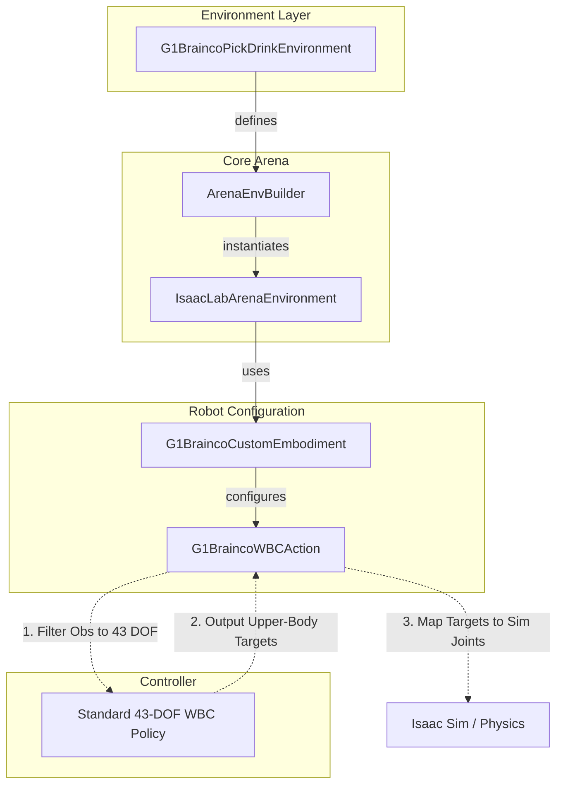

# G1 Brainco Extension

This extension provides support for the Unitree G1 humanoid robot equipped with **Brainco dexterous hands**. It includes specialized embodiments, environments, and MDP components to handle the increased degrees of freedom (DOF) while maintaining compatibility with standard Whole Body Controllers (WBC).

## Summary of Changes

- **Custom Embodiment**: Introduced `G1BraincoCustomEmbodiment` which loads the `g1_with_brainco_hands.usd` model and configures actuator groups for the dexterous fingers.
- **Specialized WBC Action**: Implemented `G1BraincoWBCAction` to solve the shape mismatch between the 43-DOF WBC policy and the 50+ DOF simulation model. It performs automatic joint mapping and observation filtering.
- **Pick & Drink Environment**: Created `G1BraincoPickDrinkEnvironment`, a complete task setup featuring:
  - High-friction material configuration for fingers to improve grasping.
  - Custom "Oficina CBA Grande" background asset.
  - Pre-defined arm postures for better task initialization.
- **Robust Path Resolution**: Added multi-variant path checking for USD assets to ensure compatibility across different deployment environments (local, Docker, etc.).

## Code Structure

```text
g1_brainco_extension/
├── embodiments/
│   └── g1_brainco.py      # Custom robot model & asset registration
├── environments/
│   └── pick_drink.py      # Task definition & background setup
├── mdp/
│   ├── robot_configs.py   # Robot-specific constants (friction, postures)
│   └── actions/
│       ├── wbc_action.py  # Mapping logic Sim <-> WBC
│       └── wbc_action_cfg.py
```

### 1. Embodiments (`embodiments/`)
The `G1BraincoCustomEmbodiment` extends the base G1 WBC embodiment. It specifically:
- Points to the USD containing the Brainco hand models.
- Overrides the `hands` actuator group to use a regex that captures all finger joints (`index`, `middle`, `pinky`, `ring`, `thumb`).
- Injects the `G1BraincoWBCActionCfg` to ensure the correct action term is used.

### 2. MDP & Actions (`mdp/actions/`)
Standard G1 WBC policies expect exactly 43 joints. The Brainco hands add significantly more. `G1BraincoWBCAction`:
- **Filters Observations**: Slices the simulation state to provide only the 43 joints the policy expects.
- **Maps Targets**: Takes the policy's upper-body targets and maps them back to the correct simulation joint indices.
- **Handles Extra Joints**: Allows the extra finger joints to be controlled or maintained without interfering with the base controller.

### 3. Environments (`environments/`)
The `G1BraincoPickDrinkEnvironment` is an `ExampleEnvironmentBase` implementation. It sets up the physical scene, including:
- A large office background (`OficinaCBAGrande`).
- An office table and task objects (e.g., beer bottle, sorting bin).
- Specific finger friction settings (`static: 6.0, dynamic: 5.0`) to prevent objects from slipping during dexterous manipulation.

## Architecture Overview



## How to Run

You can run the environment using the `policy_runner.py` script. Since this is an extension, you need to provide the class path to the environment.

### Example: Running with Zero Actions

This is useful to verify the scene setup, robot spawn, and initial posture.

```bash
python isaaclab_arena/evaluation/policy_runner.py \
    --viz kit \
    --policy_type zero_action \
    --num_steps 5000 \
    --external_environment_class_path g1_brainco_extension.environments.pick_drink:G1BraincoPickDrinkEnvironment \
    g1_brainco_pick_drink \
    --object beer_bottle 
```

### Customizing the Task
The environment supports CLI arguments for objects and destinations:

```bash
python isaaclab_arena/evaluation/policy_runner.py \
    --viz kit \
    --policy_type zero_action \
    --num_steps 5000 \
    --external_environment_class_path g1_brainco_extension.environments.pick_drink:G1BraincoPickDrinkEnvironment \
    g1_brainco_pick_drink \
    --object "coke_can" --destination "red_sorting_bin"
```

### Parameters

- `--object`: The name of the asset to pick up (must be in `AssetRegistry`).
- `--destination`: The name of the asset where the object should be placed.
- `--lock_waist`: (Boolean) Whether to lock the robot's waist joints.
- `--enable_cameras`: (Boolean) Enable/disable on-board cameras.
